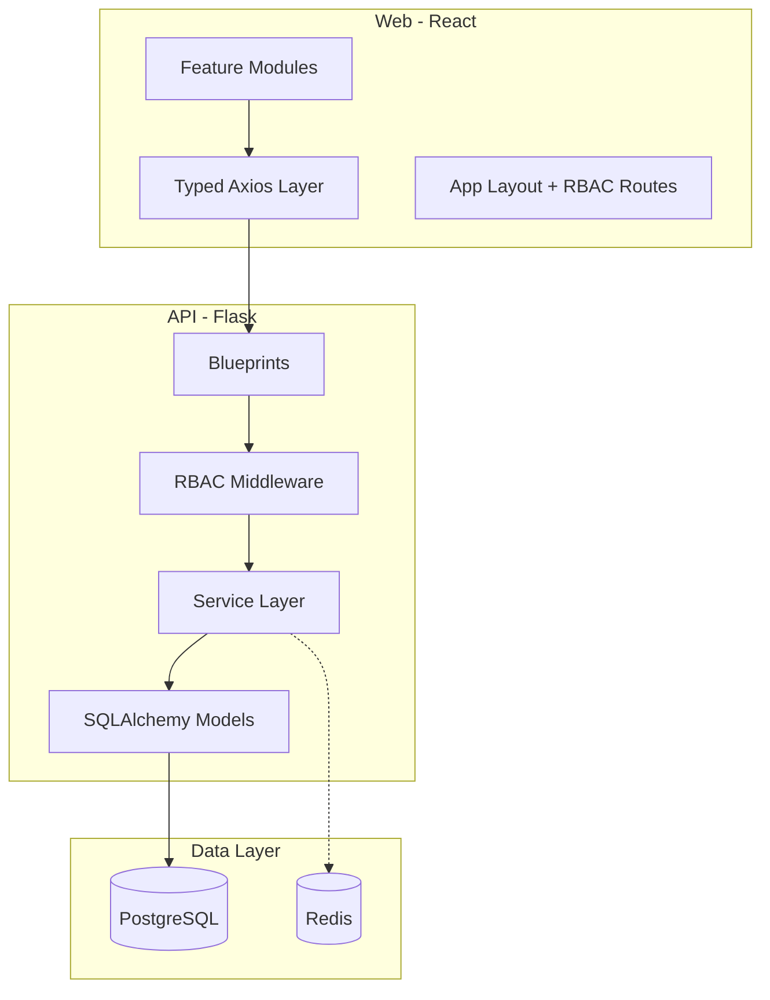

# Architecture

## Overview

Monorepo with a Flask REST API (`/api`) and React SPA (`/web`). Designed as the foundation for a capstone project with clear extension points for future modules.

## Backend Modules

| Module | Path | Responsibility |
|--------|------|----------------|
| auth | `blueprints/auth` | Login, refresh, current user |
| users | `blueprints/users` | Admin user CRUD |
| workers | `blueprints/workers` | Worker listing, skill suggestions |
| clients | `blueprints/clients` | Client management |
| job_orders | `blueprints/job_orders` | Job order CRUD, reassignment |
| operations | `blueprints/operations` | Idempotent start/complete |
| tools | `blueprints/tools` | Tool CRUD, QR, scan, event logs |

Business logic lives in `services/` — blueprints handle HTTP only.

### RBAC Enforcement

- `@require_roles(...)` decorator on every protected route
- Ownership checks in services (e.g. workers cannot access other workers' jobs)
- Role claims embedded in JWT; validated server-side on every request

### Transactions

Multi-write operations (job order + operations creation, operation status + job status update) use SQLAlchemy sessions with explicit commit/rollback.

## Frontend Modules

Feature-based folders under `src/features/`:

- `auth` — Login
- `job-orders` — List, create, edit (Admin/Office)
- `my-assignments` — Worker job list and progress (mobile-first)
- `tool-tracking` — Admin tools/logs, worker QR scanner
- `users` — Admin user management

Shared concerns:

- `api/` — Typed Axios client with JWT refresh interceptor
- `hooks/useAuth` — Auth context and role helpers
- `layouts/AppLayout` — Sidebar, header, role-aware navigation

## Extension Points (Future Capstone)

### Efficiency Analytics

Hook into `operation_service.complete_operation()` to emit events when operations finish. A future `services/analytics/` module can subscribe to these events to compute cycle times, worker throughput, and bottlenecks.

### Inventory Management

Hook into `tool_event_service.scan_tool()` and future material models. Tool custody is already derived from event history — the same pattern applies to consumable inventory.

### SMS Notifications

Add a lightweight event dispatcher stub in `services/notifications/` triggered on job status changes (`ASSIGNED`, `IN_PROGRESS`, `COMPLETED`). Wire to an SMS provider when ready.

### Automated Scheduling

Replace `worker_suggestion_service.suggest_workers()` with a scheduling algorithm. The current skill-matching suggestion preserves the "system proposes, human decides" workflow and can evolve to require Admin approval before assignment.

## Redis Usage (Current + Future)

Currently initialized in `extensions.py` with a thin wrapper. Future uses:

- Session/token blocklist on logout
- API response caching
- Background task queue (Celery/RQ) for notifications and analytics

## Database

PostgreSQL with Flask-Migrate/Alembic. All enums stored as PostgreSQL enums. Worker skills stored as JSONB with GIN index for search.

Tool custody is **never** stored as a column — always derived from the latest `ToolEvent`.

## API Versioning

All endpoints prefixed with `/api/v1` to allow future breaking changes without disrupting clients.
